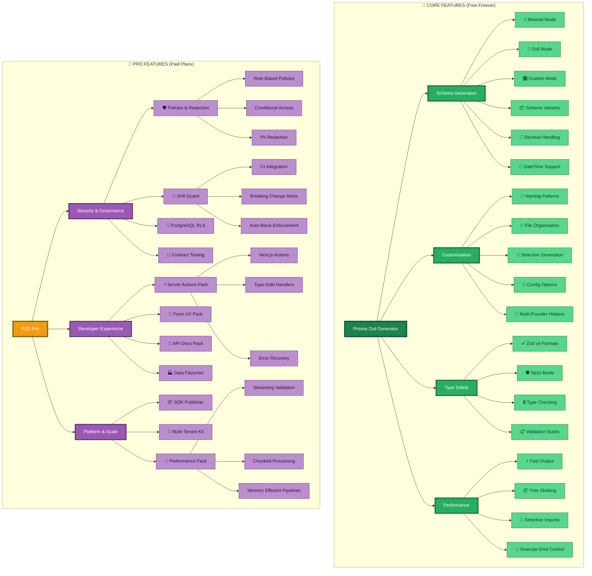
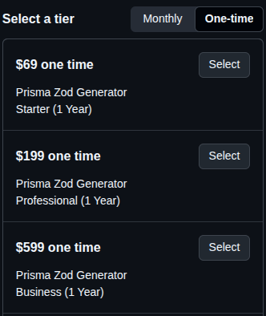

<div align="center">
	<h1>Prisma Zod Generator</h1>
	<p><strong>Unify Prisma validation, policy guardrails, and developer workflows in a single generator.</strong></p>
	<p>
		<a href="https://omar-dulaimi.github.io/prisma-zod-generator/pricing"><strong>🚀 Get PZG Pro – Purchase on GitHub</strong></a> |
		<a href="https://omar-dulaimi.github.io/prisma-zod-generator/"><strong>📚 Documentation</strong></a> |
		<a href="https://omar-dulaimi.github.io/prisma-zod-generator/docs/features/guard"><strong>🛡️ Drift Guard</strong></a>
	</p>
	<p>
		<a href="https://www.npmjs.com/package/prisma-zod-generator"></a>
		<a href="https://www.npmjs.com/package/prisma-zod-generator"></a>
		<a href="https://github.com/omar-dulaimi/prisma-zod-generator/actions"></a>
		<a href="https://github.com/omar-dulaimi/prisma-zod-generator/blob/master/LICENSE"></a>
		=5.4%20(rec%205.9)-3178c6.svg">
		
		<a href="https://omar-dulaimi.github.io/prisma-zod-generator/"></a>
		
	</p>
	<sub>
		Prisma → Zod generator for end-to-end workflows.<br/>
		🚀 generate validation · 🔐 gate policies · 📚 ship docs · ⚙️ automate server actions
	</sub>
</div>

---

> Docs: https://omar-dulaimi.github.io/prisma-zod-generator/

## 🌟 All Features (Core + Pro)

<div align="center">
  
  
</div>

<br />

<details open>
<summary>
  <h3>📋 <strong>Complete Feature Overview</strong></h3>
</summary>

<div align="center">
  <p><sub>Green = Free (MIT) • Purple/Gold = Pro (Paid)</sub></p>
</div>

<br />
<!-- diagram:diagram-01-23b43096d1 -->
<p align="center">
  
</p>
<details data-mermaid-source>
  <summary>View Mermaid source</summary>


</details>
<!-- /diagram:diagram-01-23b43096d1 -->

### 🎯 Core Features (MIT License - Free Forever)

**Schema Generation**
- ⚡ Minimal Mode - Essential CRUD only
- 🌟 Full Mode - Complete ecosystem
- 🎛️ Custom Mode - Granular control
- 📦 Schema Variants - Input, result, pure models
- 🔢 Decimal Handling - BigInt & Decimal support
- 📅 DateTime Support - ISO formats & Zod v4

**Customization**
- 🎨 Naming Patterns - Custom schema names
- 📂 Organization - File structure control
- 🎯 Selective Generation - Filter what gets generated
- 🔧 Config Options - Extensive configuration
- 🧰 Multi-Provider Helpers - Ready-made presets for each datasource

**Type Safety**
- ✅ Zod v4 Formats - ISO string methods (`.iso.date()`, `.iso.datetime()`, etc.)
- 🛡️ Strict Mode - Enforce type correctness
- 🔒 Type Checking - Full TypeScript integration
- 📋 Validation - Runtime type validation

**Performance**
- ⚡ Fast Output - Optimized generation
- 📦 Tree Shaking - Remove unused code
- 🎯 Selective Imports - Import only what you need
- 📁 Granular Emit Control - Precise directory + preset outputs

---

### 💎 Pro Features (Paid Plans)

**Security & Governance**
- 🛡️ **Policies & Redaction** (Professional+) - Role-based policies, conditional access, PII protection
- 🚨 **Drift Guard** (Professional+) - Breaking change detection, CI integration
- 🐘 **PostgreSQL RLS** (Professional+) - Row-level security, tenant isolation
- 🧪 **Contract Testing** (Business+) - Pact.js integration, consumer-driven contracts

**Developer Experience**
- ⚡ **Server Actions Pack** (Starter+) - Next.js typed server actions
- 📝 **Form UX Pack** (Starter+) - React Hook Form + UI library integration
- 📄 **API Docs Pack** (Business+) - OpenAPI v3, Swagger UI generation
- 🏭 **Data Factories** (Business+) - Test data generation

**Platform & Scale**
- 📦 **SDK Publisher** (Professional+) - Generate typed client SDKs
- 🏢 **Multi-Tenant Kit** (Enterprise) - Tenant isolation, context management
- 🚀 **Performance Pack** (Professional+) - Streaming validation, chunked processing, memory efficient

<div align="center">
  <p>
    <a href="https://omar-dulaimi.github.io/prisma-zod-generator/pricing"><strong>View Pricing & Plans</strong></a> |
    <a href="https://omar-dulaimi.github.io/prisma-zod-generator/docs"><strong>Full Documentation</strong></a>
  </p>
</div>

</details>

<br />

---

## 📖 Quick Start

> ⭐️ Tip: Star the repo to keep track of new generators, recipes, and fixes.

```bash
# Install
npm install -D prisma-zod-generator

# Add to schema.prisma
generator zod {
  provider = "prisma-zod-generator"
}

# Generate
npx prisma generate
```

## 🧠 Config IntelliSense

Point your config file at the published JSON Schema to get autocomplete, hover docs, and validation errors in any JSON-aware editor:

```json title="prisma/config.json"
{
  "$schema": "../node_modules/prisma-zod-generator/lib/config/schema.json",
  "mode": "full"
}
```

Use a relative path that matches your repo layout (for example `./node_modules/...`). See the [JSON Schema IntelliSense guide](https://omar-dulaimi.github.io/prisma-zod-generator/docs/config/schema-json) for monorepo examples, CI validation scripts, and tips on shipping the schema with custom tooling.

## 💡 Usage Examples

- See the [full documentation](https://omar-dulaimi.github.io/prisma-zod-generator/) for detailed guides, upgrade notes, and feature walkthroughs.
- Browse `recipes/` for copy-paste presets, CI snippets, and integration templates that match your stack.
- Share `llms.txt` with AI copilots for an on-ramp to the architecture, commands, and conventions.

## ❤️ Sponsor Development

If Prisma Zod Generator saves you time or catches bugs before production, consider sponsoring to fund maintenance and new feature work.

- On GitHub Sponsors, switch to the **One-time** tab (second tab) to see the PZG plan tiers. Pick the
  yearly tiers labeled **PZG Starter**, **PZG Professional**, **PZG Business**, or **PZG Enterprise** to
  unlock the corresponding Pro licenses—monthly “support” tiers (e.g., *Pro (Individual)*) in the
  Monthly tab do not include PZG Pro.

<p align="center">
  
  <br />
  <sub>Open the One-time tab to see the Prisma Zod Generator Starter, Professional, and Business tiers.</sub>
</p>
- Become a sponsor: https://github.com/sponsors/omar-dulaimi

## 🤝 Contributing

PRs are welcome! Keep diffs focused, open an issue before large refactors, and lean on the test suites for expected behavior and coverage.

## 🖼️ Updating Diagrams

When you edit Mermaid blocks in this README, run `pnpm render:diagrams` afterwards. The script refreshes the SVG fallbacks in `docs/assets/diagrams/` so diagrams render correctly on npm and GitHub Mobile.

## 📄 License

MIT © [Omar Dulaimi](https://github.com/omar-dulaimi)

**Core features**: MIT licensed, free forever  
**Pro features**: Commercial license, see [pricing](https://omar-dulaimi.github.io/prisma-zod-generator/pricing)
