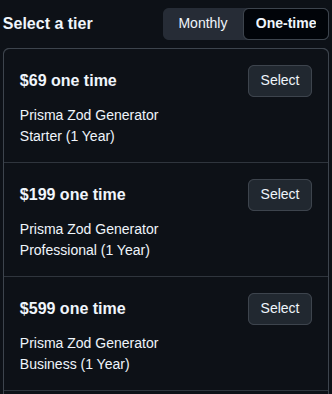

# Prisma Zod Generator

A Prisma generator that emits [Zod](https://zod.dev) schemas from your Prisma schema. It runs as part of
`prisma generate`, so your validation schemas are regenerated from the same source of truth as your Prisma Client.

[](https://www.npmjs.com/package/prisma-zod-generator)
[](https://www.npmjs.com/package/prisma-zod-generator)
[](https://github.com/omar-dulaimi/prisma-zod-generator/actions)
[](https://github.com/omar-dulaimi/prisma-zod-generator/blob/master/LICENSE)

[Documentation](https://omar-dulaimi.github.io/prisma-zod-generator/) ·
[PZG Pro](https://omar-dulaimi.github.io/prisma-zod-generator/pricing)

## Requirements

| Dependency | Supported                                         |
| ---------- | ------------------------------------------------- |
| Node.js    | >= 20.19.0 (22.x recommended)                     |
| Prisma     | 7.x                                               |
| Zod        | >= 3.25.0 < 5 (both v3 and v4 output are emitted) |
| TypeScript | >= 5.4 (5.9.x recommended)                        |

## Install

```bash
npm install --save-dev prisma-zod-generator
npm install zod
```

Install the generator locally rather than globally: Prisma resolves the generator executable from
`node_modules/.bin`, so a project-local install is what makes `provider = "prisma-zod-generator"` work.
`zod` is a peer dependency (`>=3.25.0 <5`) because the generated files import it at runtime.

## Usage

Add the generator to `schema.prisma`:

```prisma
generator client {
  provider = "prisma-client"
  output   = "../src/generated/prisma"
}

generator zod {
  provider = "prisma-zod-generator"
  // output defaults to <schema dir>/generated
  // config = "./zod-generator.config.json"
}
```

Then run:

```bash
npx prisma generate
```

With no configuration you get one schema file per Prisma CRUD operation, plus the input object and enum
schemas they reference:

```
prisma/generated/schemas/
├── findManyUser.schema.ts     # UserFindManySchema, UserFindManyZodSchema
├── createOneUser.schema.ts    # UserCreateOneSchema, UserCreateOneZodSchema
├── objects/                   # UserWhereInputObjectSchema, UserCreateInputObjectSchema, ...
├── enums/                     # SortOrderSchema, UserScalarFieldEnumSchema, ...
├── results/                   # UserFindManyResultSchema, ...
├── variants/                  # pure/ input/ result/ variants of each model
└── index.ts                   # barrel re-export
```

A `helpers/` directory is emitted next to `schemas/` when the Prisma schema contains `Json` or `Decimal`
fields, and `models/` appears under `schemas/` once `pureModels` is enabled.

Every operation file exports the schema twice. `<Model><Operation>Schema` is annotated as
`z.ZodType<Prisma.<Model><Operation>Args>`, so parsed output can be handed straight to the Prisma Client;
`<Model><Operation>ZodSchema` is the unannotated object, for when you need `.extend()`, `.partial()` or
`.omit()`.

```ts
import { UserFindManySchema } from './prisma/generated/schemas/findManyUser.schema';

const args = UserFindManySchema.parse(req.query);
const users = await prisma.user.findMany(args);
```

### Model schemas

Set `pureModels: true` to also emit one plain schema per model, with no CRUD wrappers and no Prisma types:

```ts
// prisma/generated/schemas/models/User.schema.ts
import * as z from 'zod';

export const UserSchema = z.object({
  id: z.number().int(),
  email: z.string(),
  name: z.string().nullish(),
});

export type UserType = z.infer<typeof UserSchema>;
```

### Validators declared in the Prisma schema

`@zod` annotations in triple-slash comments are compiled into the generated field schemas:

```prisma
model User {
  id    Int     @id @default(autoincrement())
  /// @zod.email()
  email String  @unique
  /// @zod.min(2).max(80)
  name  String?
}
```

See [Zod comment annotations](https://omar-dulaimi.github.io/prisma-zod-generator/docs/pipeline/zod-comments)
for the supported validators, custom imports, and metadata annotations.

## Configuration

Options can be set in the generator block or in a JSON file next to `schema.prisma`.
`zod-generator.config.json` is discovered automatically; any other path can be passed via
`config = "./my-config.json"` (resolved relative to the schema file).

```json
{
  "$schema": "../node_modules/prisma-zod-generator/lib/config/schema.json",
  "mode": "full",
  "pureModels": true,
  "useMultipleFiles": true
}
```

The `$schema` line gives autocomplete, hover docs, and validation in any JSON-aware editor; adjust the
relative path to match your layout. Commonly used options: `mode` (`full` | `minimal` | `custom`), `output`,
`useMultipleFiles` / `singleFileName`, `pureModels`, `variants`, `naming`, `optionalFieldBehavior`,
`dateTimeStrategy`, `strictMode`, `emit`, `zodImportTarget`, `zodImportPath`. `useMultipleFiles: false`
collapses the output into a single `schemas.ts`.

- [Quick start](https://omar-dulaimi.github.io/prisma-zod-generator/docs/intro/quick-start)
- [Configuration precedence](https://omar-dulaimi.github.io/prisma-zod-generator/docs/config/precedence)
- [File layout and single-file mode](https://omar-dulaimi.github.io/prisma-zod-generator/docs/config/file-layout)
- [JSON Schema IntelliSense](https://omar-dulaimi.github.io/prisma-zod-generator/docs/config/schema-json)
- [Troubleshooting](https://omar-dulaimi.github.io/prisma-zod-generator/docs/reference/troubleshooting)

The [`recipes/`](recipes) directory holds ready-made config presets (minimal CRUD, models only, single file,
tRPC-optimized, and more); each one is a `zod-generator.config.json` with a short README explaining the
trade-offs.

## PZG Pro

The generator above is MIT licensed and complete on its own. The commercial packs generate the layers
people usually hand-write around it:

- **Server Actions** — typed Next.js `'use server'` actions per model, validation already wired in.
- **Form UX** — working forms from your schema for shadcn, MUI, Chakra, Mantine, or plain elements,
  with react-hook-form and your Zod schemas connected.
- **Policies & Redaction** — turn `/// @policy` and `/// @pii` comments in your schema into enforced
  access rules and redacted logs, plus PostgreSQL row-level security.
- **Drift Guard** — a CI command that compares two git refs and fails the build on a breaking schema
  change, with an allow-list for the ones you accept.
- **SDK Publisher** — a publishable TypeScript or Python client for your models.
- **API Docs, Contract Testing, Data Factories, Performance, Multi-Tenant Kit** — OpenAPI plus a mock
  server, Pact consumer and provider tests, seed factories typed to your schema, precompiled
  generation for large schemas, and tenant isolation enforced in the client.

| Pack                                                                          | Minimum plan |
| ----------------------------------------------------------------------------- | ------------ |
| Server Actions, Form UX                                                       | Starter      |
| Policies & Redaction, Drift Guard, PostgreSQL RLS, SDK Publisher, Performance  | Professional |
| API Docs, Contract Testing, Data Factories                                    | Business     |
| Multi-Tenant Kit                                                              | Enterprise   |

Pro code ships inside the published package, is unlocked with a `PZG_LICENSE_KEY`, and is invoked
through the bundled `pzg-pro` CLI.
[Pro features](https://omar-dulaimi.github.io/prisma-zod-generator/docs/features/overview) ·
[Pricing](https://omar-dulaimi.github.io/prisma-zod-generator/pricing)

### Buying a licence

Licences are sold through GitHub Sponsors, which needs one thing spelled out: open the
**One-time** tab — the second one — and pick a yearly **PZG Starter**, **PZG Professional**,
**PZG Business**, or **PZG Enterprise** tier. The monthly support tiers on the first tab do **not**
include a PZG Pro licence.



<https://github.com/sponsors/omar-dulaimi>

## Sponsor

Sponsorships fund maintenance and new feature work, separately from any Pro licence:
<https://github.com/sponsors/omar-dulaimi>

## Contributing

Issues and pull requests are welcome. See [CONTRIBUTING.md](CONTRIBUTING.md) for the repository layout,
commit conventions, and test commands. Please open an issue before large refactors, and keep diffs focused.

## License

MIT © [Omar Dulaimi](https://github.com/omar-dulaimi) — see [LICENSE](LICENSE).
PZG Pro packs are covered by a separate commercial license ([LICENSE-PRO.md](LICENSE-PRO.md)).
