```mermaid
graph TB
    subgraph "🔧 Generation Modes"
        A[Prisma Schema] --> B["🌟 Full Mode<br/>Complete Ecosystem"]
        A --> C["⚡ Minimal Mode<br/>Essential CRUD Only"]
        A --> D["🎛️ Custom Mode<br/>Granular Control"]

        B --> B1[CRUD Operations]
        B --> B2[Input Objects]
        B --> B3[Result Schemas]
        B --> B4[Enum Schemas]
        B --> B5[Schema Variants]

        C --> C1[Basic CRUD Only]
        C --> C2[Lean Output]

        D --> D1[User-Defined Rules]
        D --> D2[Selective Generation]
    end

    style A fill:#ff6b6b,stroke:#333,stroke-width:3px,color:#fff
    style B fill:#4ecdc4,stroke:#333,stroke-width:2px,color:#fff
    style C fill:#45b7d1,stroke:#333,stroke-width:2px,color:#fff
    style D fill:#96ceb4,stroke:#333,stroke-width:2px,color:#fff
```

```mermaid
graph LR
    subgraph "🔍 Filtering & Selection System"
        SC[Schema Config] --> FS{Filtering System}

        FS --> MF["🎯 Model<br/>Filtering"]
        FS --> OF["⚙️ Operation<br/>Filtering"]
        FS --> FF["📋 Field<br/>Filtering"]
        FS --> WP["🌐 Wildcard<br/>Patterns"]

        MF --> MF1["Include Models:<br/>User, Post"]
        MF --> MF2["Exclude Models:<br/>Internal*"]

        OF --> OF1["Generate:<br/>findMany, create"]
        OF --> OF2["Skip:<br/>deleteMany"]

        FF --> FF1["Include Fields:<br/>id, email"]
        FF --> FF2["Exclude Fields:<br/>password"]

        WP --> WP1["Patterns:<br/>*Schema"]
        WP --> WP2["Glob Matching:<br/>User*Input"]
    end

    style SC fill:#ff6b6b,stroke:#333,stroke-width:3px,color:#fff
    style FS fill:#e74c3c,stroke:#333,stroke-width:2px,color:#fff
    style MF fill:#3498db,stroke:#333,stroke-width:2px,color:#fff
    style OF fill:#9b59b6,stroke:#333,stroke-width:2px,color:#fff
    style FF fill:#f39c12,stroke:#333,stroke-width:2px,color:#fff
    style WP fill:#27ae60,stroke:#333,stroke-width:2px,color:#fff
```

```mermaid
graph TD
    subgraph "📁 File Organization"
        FO[File Output] --> MFO["📂 Multi-file<br/>Output (default)"]
        FO --> SFB["📄 Single-file<br/>Bundle"]
        FO --> CDS["🗂️ Custom Directory<br/>Structure"]
        FO --> EIE["🔗 ESM Import<br/>Extensions"]

        MFO --> MFO1["schemas/user.ts"]
        MFO --> MFO2["schemas/post.ts"]
        MFO --> MFO3["objects/input.ts"]

        SFB --> SFB1["index.ts<br/>(all schemas)"]

        CDS --> CDS1["custom/path/"]
        CDS --> CDS2["nested/structure/"]

        EIE --> EIE1["import './schema.js'"]
        EIE --> EIE2["ESM Compatible"]
    end

    style FO fill:#4ecdc4,stroke:#333,stroke-width:3px,color:#fff
    style MFO fill:#3498db,stroke:#333,stroke-width:2px,color:#fff
    style SFB fill:#f39c12,stroke:#333,stroke-width:2px,color:#fff
    style CDS fill:#9b59b6,stroke:#333,stroke-width:2px,color:#fff
    style EIE fill:#27ae60,stroke:#333,stroke-width:2px,color:#fff
```

```mermaid
graph LR
    subgraph "🏷️ Naming Control System"
        NC[Naming Config] --> NS{Naming Strategy}

        NS --> PR["🎨 Presets"]
        NS --> CP["📝 Custom<br/>Patterns"]
        NS --> ENC["🔧 Export Name<br/>Control"]
        NS --> TT["🧩 Token<br/>Templates"]

        PR --> PR1["default"]
        PR --> PR2["zod-prisma"]
        PR --> PR3["custom-preset"]

        CP --> CP1["UserCreateSchema"]
        CP --> CP2["user.create.schema"]

        ENC --> ENC1["Custom Exports"]
        ENC --> ENC2["Alias Support"]

        TT --> TT1["{Model}"]
        TT --> TT2["{operation}"]
        TT --> TT3["{kebab-case}"]
    end

    style NC fill:#f39c12,stroke:#333,stroke-width:3px,color:#fff
    style NS fill:#f39c12,stroke:#333,stroke-width:2px,color:#fff
    style PR fill:#3498db,stroke:#333,stroke-width:2px,color:#fff
    style CP fill:#9b59b6,stroke:#333,stroke-width:2px,color:#fff
    style ENC fill:#27ae60,stroke:#333,stroke-width:2px,color:#fff
    style TT fill:#e74c3c,stroke:#333,stroke-width:2px,color:#fff
```

```mermaid
graph TD
    subgraph "🔒 Type Safety System"
        TS[Type Safety] --> DE["🎭 Dual Exports"]
        TS --> STB["🔗 Strict Type<br/>Binding"]
        TS --> MS["📦 Module<br/>Support"]
        TS --> TO["⚡ Tree-shake<br/>Optimized"]

        DE --> DE1["Typed Schemas<br/>(Prisma bound)"]
        DE --> DE2["Pure Schemas<br/>(Zod only)"]

        STB --> STB1["Explicit Types"]
        STB --> STB2["Type Annotations"]

        MS --> MS1["ESM Support"]
        MS --> MS2["CJS Support"]

        TO --> TO1["Selective Imports"]
        TO --> TO2["Minimal Bundles"]
    end

    style TS fill:#8e44ad,stroke:#333,stroke-width:3px,color:#fff
    style DE fill:#3498db,stroke:#333,stroke-width:2px,color:#fff
    style STB fill:#27ae60,stroke:#333,stroke-width:2px,color:#fff
    style MS fill:#f39c12,stroke:#333,stroke-width:2px,color:#fff
    style TO fill:#e74c3c,stroke:#333,stroke-width:2px,color:#fff
```

```mermaid
graph LR
    subgraph "💾 Data Handling Pipeline"
        DH[Data Handler] --> DT{Data Types}

        DT --> JSON["🗃️ JSON<br/>Fields"]
        DT --> BYTES["📊 Bytes<br/>Fields"]
        DT --> DT_TIME["📅 DateTime<br/>Strategy"]
        DT --> OPT["❓ Optional/<br/>Nullable"]

        JSON --> JSON1["Enhanced Validation"]
        JSON --> JSON2["Transform Support"]

        BYTES --> BYTES1["Buffer Handling"]
        BYTES --> BYTES2["Uint8Array Support"]

        DT_TIME --> DT1["Date Objects"]
        DT_TIME --> DT2["String Conversion"]

        OPT --> OPT1["Optional Fields"]
        OPT --> OPT2["Nullable Config"]
    end

    style DH fill:#2ecc71,stroke:#333,stroke-width:3px,color:#fff
    style DT fill:#2ecc71,stroke:#333,stroke-width:2px,color:#fff
    style JSON fill:#3498db,stroke:#333,stroke-width:2px,color:#fff
    style BYTES fill:#9b59b6,stroke:#333,stroke-width:2px,color:#fff
    style DT_TIME fill:#f39c12,stroke:#333,stroke-width:2px,color:#fff
    style OPT fill:#e74c3c,stroke:#333,stroke-width:2px,color:#fff
```

```mermaid
graph TD
    subgraph "🎨 Advanced Features"
        AF[Advanced Features] --> ZC["💬 @zod Comments"]
        AF --> JSR["🌐 JSON Schema<br/>Ready"]
        AF --> CDF["🔄 Circular<br/>Dependency Fix"]
        AF --> AO["📊 Aggregate<br/>Operations"]
        AF --> SIS["🎯 Select/Include<br/>Schemas"]
        AF --> CZI["🔧 Custom Zod<br/>Imports"]

        ZC --> ZC1["// @zod.min(5)"]
        ZC --> ZC2["// @zod.max(100)"]
        ZC --> ZC3["🚀 Enhanced Parser"]
        ZC --> ZC4["Complex Objects"]
        ZC --> ZC5["Nested Expressions"]

        ZC3 --> ZC3A["Nested Parentheses"]
        ZC3 --> ZC3B["JS Object Literals"]
        ZC4 --> ZC4B["Any Parameter Type"]
        ZC5 --> ZC5B["Function Calls"]

        JSR --> JSR1["OpenAPI Ready"]
        JSR --> JSR2["z.toJSONSchema()"]

        CDF --> CDF1["Smart Relations"]
        CDF --> CDF2["z.lazy() Usage"]

        AO --> AO1["count, min, max"]
        AO --> AO2["avg, sum ops"]

        SIS --> SIS1["Prisma Compatible"]
        SIS --> SIS2["Type-safe Selection"]

        CZI --> CZI1["Custom Import Path"]
        CZI --> CZI2["Flexible Sources"]
    end

    style AF fill:#e67e22,stroke:#333,stroke-width:3px,color:#fff
    style ZC fill:#9b59b6,stroke:#333,stroke-width:2px,color:#fff
    style JSR fill:#3498db,stroke:#333,stroke-width:2px,color:#fff
    style CDF fill:#27ae60,stroke:#333,stroke-width:2px,color:#fff
    style AO fill:#f39c12,stroke:#333,stroke-width:2px,color:#fff
    style SIS fill:#e74c3c,stroke:#333,stroke-width:2px,color:#fff
    style CZI fill:#8e44ad,stroke:#333,stroke-width:2px,color:#fff
```

```mermaid
graph LR
    subgraph "⚡ Performance Optimization"
        PO[Performance] --> LL["🔄 Lazy<br/>Loading"]
        PO --> MB["📦 Minimal<br/>Bundles"]
        PO --> FG["🚀 Fast<br/>Generation"]

        LL --> LL1["Circular Imports"]
        LL --> LL2["z.lazy() Pattern"]
        LL --> LL3["On-demand Loading"]

        MB --> MB1["Tree-shaking"]
        MB --> MB2["Selective Exports"]
        MB --> MB3["Dead Code Elimination"]

        FG --> FG1["Optimized Pipeline"]
        FG --> FG2["Efficient Processing"]
        FG --> FG3["Quick Schema Build"]
    end

    style PO fill:#27ae60,stroke:#333,stroke-width:3px,color:#fff
    style LL fill:#3498db,stroke:#333,stroke-width:2px,color:#fff
    style MB fill:#9b59b6,stroke:#333,stroke-width:2px,color:#fff
    style FG fill:#e74c3c,stroke:#333,stroke-width:2px,color:#fff
```

```mermaid
graph TD
    subgraph "🛡️ Safety & Validation System"
        SS[Safety System] --> CSS["🔒 Configurable<br/>Safety System"]
        SS --> OPP["🛣️ Output Path<br/>Protection"]
        SS --> FCD["⚠️ File Collision<br/>Detection"]
        SS --> CV["✅ Config<br/>Validation"]
        SS --> UEG["🏷️ Unused Enum<br/>Generation"]

        CSS --> CSS1["Manifest Tracking"]
        CSS --> CSS2["Strict Controls"]
        CSS --> CSS3["Enterprise Grade"]

        OPP --> OPP1["Prevent Overwrites"]
        OPP --> OPP2["Safe Paths Only"]

        FCD --> FCD1["Naming Conflicts"]
        FCD --> FCD2["Warning System"]

        CV --> CV1["JSON Schema"]
        CV --> CV2["Type Validation"]

        UEG --> UEG1["Include All Enums"]
        UEG --> UEG2["Complete Coverage"]
    end

    style SS fill:#c0392b,stroke:#333,stroke-width:3px,color:#fff
    style CSS fill:#e74c3c,stroke:#333,stroke-width:2px,color:#fff
    style OPP fill:#f39c12,stroke:#333,stroke-width:2px,color:#fff
    style FCD fill:#ff7675,stroke:#333,stroke-width:2px,color:#fff
    style CV fill:#27ae60,stroke:#333,stroke-width:2px,color:#fff
    style UEG fill:#9b59b6,stroke:#333,stroke-width:2px,color:#fff
```

```mermaid
graph TD
    subgraph "🗄️ Universal Database Support"
        DS[Database Support] --> PG["🐘 PostgreSQL"]
        DS --> MY["🐬 MySQL"]
        DS --> SQ["📂 SQLite"]
        DS --> MG["🍃 MongoDB"]
        DS --> SS["🏢 SQL Server"]
        DS --> CR["🪳 CockroachDB"]

        PG --> PG1["✅ Arrays Support"]
        PG --> PG2["✅ JSON Fields"]
        PG --> PG3["✅ Full Features"]
        PG --> PG4["✅ Advanced Types"]

        MY --> MY1["✅ Complete Compatibility"]
        MY --> MY2["✅ All Data Types"]

        SQ --> SQ1["✅ Full Feature Support"]
        SQ --> SQ2["✅ Embedded Ready"]

        MG --> MG1["✅ Document Models"]
        MG --> MG2["✅ NoSQL Features"]

        SS --> SS1["✅ Complete Compatibility"]
        SS --> SS2["✅ Enterprise Ready"]

        CR --> CR1["✅ PostgreSQL Compatible"]
        CR --> CR2["✅ Distributed Ready"]
    end

    style DS fill:#34495e,stroke:#333,stroke-width:3px,color:#fff
    style PG fill:#336791,stroke:#333,stroke-width:2px,color:#fff
    style MY fill:#4479a1,stroke:#333,stroke-width:2px,color:#fff
    style SQ fill:#003b57,stroke:#333,stroke-width:2px,color:#fff
    style MG fill:#47a248,stroke:#333,stroke-width:2px,color:#fff
    style SS fill:#cc2927,stroke:#333,stroke-width:2px,color:#fff
    style CR fill:#6933ff,stroke:#333,stroke-width:2px,color:#fff
```

<div align="center">
	<h1>Prisma Zod Generator</h1>
	<p><strong>Prisma → Zod in one generate. Ship validated, typed data everywhere.</strong></p>
	<p>
		<a href="https://www.npmjs.com/package/prisma-zod-generator"></a>
		<a href="https://www.npmjs.com/package/prisma-zod-generator"></a>
		<a href="https://github.com/omar-dulaimi/prisma-zod-generator/actions"></a>
		<a href="https://github.com/omar-dulaimi/prisma-zod-generator/blob/master/LICENSE"></a>
		
		
		<a href="https://omar-dulaimi.github.io/prisma-zod-generator/"></a>
	</p>
	<sub>
		Prisma → Zod generator: zero‑boilerplate validation for your models.<br/>
		🚀 enhanced parser · ✍️ complex expressions · ⚡ fast/minimal mode · 🎯 selective filtering · 🔒 strict types
	</sub>
</div>

---

> Docs: https://omar-dulaimi.github.io/prisma-zod-generator/

## ✨ Core Features

<div align="center">
  
  
  
  
</div>

<br />

<!-- ===== SCHEMA GENERATION SECTION ===== -->
<details open>
<summary>
  <h3>🎯 <strong>Schema Generation & Types</strong></h3>
</summary>

<table>
<tr>
<td width="50%" valign="top">

<div align="center">
  
</div>

<br />

<details class="diagram-source">
<summary>Mermaid source</summary>



</details>

<!-- diagram:diagram-01-7d1132fdf6 -->
<p align="center">
  
</p>
<!-- /diagram:diagram-01-7d1132fdf6 -->


<div align="center">
  
</div>

<br />

<details class="diagram-source">
<summary>Mermaid source</summary>


</details>

<!-- diagram:diagram-02-9a773c8224 -->
<p align="center">
  
</p>
<!-- /diagram:diagram-02-9a773c8224 -->


</td>
<td width="50%" valign="top">

<div align="center">
  
</div>

<br />

<details class="diagram-source">
<summary>Mermaid source</summary>


</details>

<!-- diagram:diagram-03-74e5143daa -->
<p align="center">
  
</p>
<!-- /diagram:diagram-03-74e5143daa -->


<div align="center">
  
</div>

<br />

<details class="diagram-source">
<summary>Mermaid source</summary>



</details>

<!-- diagram:diagram-04-eaa9e24b2a -->
<p align="center">
  
</p>
<!-- /diagram:diagram-04-eaa9e24b2a -->


</td>
</tr>
</table>

</details>

<br />

<!-- ===== CUSTOMIZATION SECTION ===== -->
<details open>
<summary>
  <h3>🛠️ <strong>Customization & Organization</strong></h3>
</summary>

<table>
<tr>
<td width="33%" valign="top">

<div align="center">
  
</div>

<br />

<details class="diagram-source">
<summary>Mermaid source</summary>



</details>

<!-- diagram:diagram-05-d7f60e92d2 -->
<p align="center">
  
</p>
<!-- /diagram:diagram-05-d7f60e92d2 -->


<br />

<details class="diagram-source">
<summary>Mermaid source</summary>



</details>

<!-- diagram:diagram-06-b47cb41f1c -->
<p align="center">
  
</p>
<!-- /diagram:diagram-06-b47cb41f1c -->


</td>
<td width="33%" valign="top">

<div align="center">
  
</div>

<br />

<details class="diagram-source">
<summary>Mermaid source</summary>



</details>

<!-- diagram:diagram-07-7aafa72152 -->
<p align="center">
  
</p>
<!-- /diagram:diagram-07-7aafa72152 -->


<br />

<details class="diagram-source">
<summary>Mermaid source</summary>



</details>

<!-- diagram:diagram-08-57b4dbf675 -->
<p align="center">
  
</p>
<!-- /diagram:diagram-08-57b4dbf675 -->


</td>
<td width="33%" valign="top">

<div align="center">
  
</div>

<br />

<details class="diagram-source">
<summary>Mermaid source</summary>



</details>

<!-- diagram:diagram-09-99751db375 -->
<p align="center">
  
</p>
<!-- /diagram:diagram-09-99751db375 -->


<br />

<details class="diagram-source">
<summary>Mermaid source</summary>



</details>

<!-- diagram:diagram-10-693f6cced2 -->
<p align="center">
  
</p>
<!-- /diagram:diagram-10-693f6cced2 -->


</td>
</tr>
</table>

</details>

<br />

<!-- ===== SAFETY & DATABASE SECTION ===== -->
<details open>
<summary>
  <h3>🛡️ <strong>Safety & Database Ecosystem</strong></h3>
</summary>

<table>
<tr>
<td width="50%" valign="top">

<div align="center">
  
</div>

<br />

<details class="diagram-source">
<summary>Mermaid source</summary>



</details>

<!-- diagram:diagram-11-303cab24a4 -->
<p align="center">
  
</p>
<!-- /diagram:diagram-11-303cab24a4 -->


</td>
<td width="50%" valign="top">

<div align="center">
  
</div>

<br />

<details class="diagram-source">
<summary>Mermaid source</summary>



</details>

<!-- diagram:diagram-12-216a09ac5c -->
<p align="center">
  
</p>
<!-- /diagram:diagram-12-216a09ac5c -->


</td>
</tr>
</table>

</details>


## Prerequisites

- Node.js 18+
- Prisma installed and initialized (`npx prisma init`)
- Zod installed (runtime for generated schemas)

## Quick start

1) Star this repo 🌟

2) Install

```bash
npm i -D prisma-zod-generator
# pnpm: pnpm add -D prisma-zod-generator
# yarn: yarn add -D prisma-zod-generator
# bun:  bun add -d prisma-zod-generator
```

3) Add a generator block to your `schema.prisma`

```prisma
generator zod {
	provider = "prisma-zod-generator"
}
```

4) Generate

```bash
npx prisma generate
```

5) Import and use

```ts
// Default output exports an index; adjust path if you customized output
import { UserSchema } from './prisma/generated/schemas';

// Validate data
const parsed = UserSchema.safeParse({ id: 'clx...', email: 'a@b.com' });
if (!parsed.success) console.error(parsed.error.format());
```

## Docs & recipes

- Guides and recipes: https://omar-dulaimi.github.io/prisma-zod-generator/
- See `recipes/` in this repo for ready‑to‑copy setups

## Sponsor ❤️

If this saves you time or prevents bugs, please consider sponsoring to support maintenance and new features.

→ https://github.com/sponsors/omar-dulaimi

## Contributing

PRs welcome. Keep diffs focused and discuss larger changes in an issue first. See the test suites for expected behavior and coverage.

**Updating diagrams**

If you edit Mermaid diagrams in this README, run `pnpm render:diagrams` afterwards. The script renders SVG fallbacks to `docs/assets/diagrams` and refreshes the generated image references so diagrams display correctly on npm and GitHub mobile.

## License

MIT © [Omar Dulaimi](https://github.com/omar-dulaimi)
